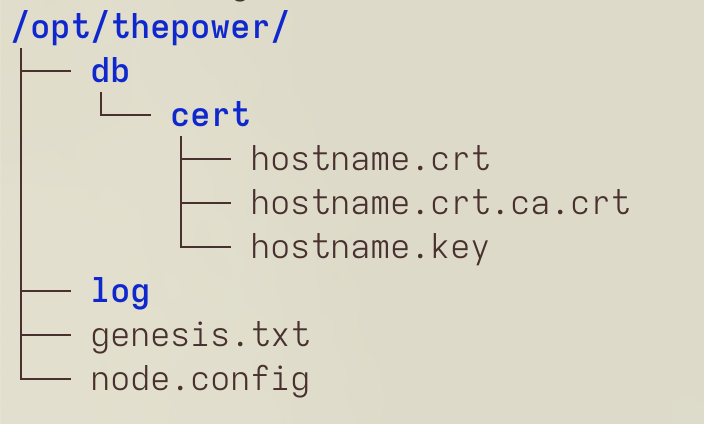

# Starting the node using `docker-compose`

<!-- START doctoc generated TOC please keep comment here to allow auto update -->
<!-- DON'T EDIT THIS SECTION, INSTEAD RE-RUN doctoc TO UPDATE -->
**Table of Contents**

   - [Introduction](#introduction)
   - [Setting up the environment](#setting-up-the-environment)
   - [Starting the node](#starting-the-node)
   - [Stopping the node](#stopping-the-node)

<!-- END doctoc generated TOC please keep comment here to allow auto update -->

## Introduction

You can also start your node using `docker-compose`, which is even easier than starting your node using conventional Docker commands described [here](./02-download-build-run-docker.md).

## Setting up the environment

You need to have `docker-compose` package installed on your machine. If you don't have this package installed, run the following command in terminal for:

1. `root` user:

   ```bash
   apt-get -y install docker-compose
   ```

2. Normal user:

   ```bash
   sudo apt-get -y install docker-compose
   ```

   :::info Attention

   By implementing this way of starting the node we assume that

   - `node.config`,
   - `genesis.txt`,
   - SSL keys,
   - `db` and `log` directories

   are present and stored in `/opt/thepower/` like described in [Docker](./02-download-build-run-docker.md) and [source](./03-download-build-run-source.md) manuals.

   The following tree describes the directories and files in them:

   

   `hostname` here is an example. Please, **replace** it with the hostname specified in your `node.config` file.

   :::

3. Go to `/opt/thepower`:

   ```bash
   cd /opt/thepower
   ```

4. Create `docker-compose.yml` file with the following code:

   ```yaml
   version: "3.3"
   
   services:
   
     tpnode:
       restart: unless-stopped
       container_name: tpnode
       image: thepowerio/tpnode
       volumes:
         - type: bind
           source: /opt/thepower/node.config
           target: /opt/thepower/node.config
           read_only: true
         - type: bind
           source: /opt/thepower/genesis.txt
           target: /opt/thepower/genesis.txt
           read_only: true
         - type: bind
           source: /opt/thepower/db
           target: /opt/thepower/db
         - type: bind
           source: /opt/thepower/log
           target: /opt/thepower/log
       ports:
         - 1080:1080
         - 1443:1443
         - 1800:1800
   
     watchtower:
       restart: unless-stopped
       container_name: watchtower
       image: containrrr/watchtower
       volumes:
         - /var/run/docker.sock:/var/run/docker.sock
       command: --interval 3600 --cleanup
   ```

   :::tip Note

   This file also allows `watchtower` to automatically update the node.

   :::

## Starting the node

To start the node:

1. Ensure, that you are in `/opt/thepower` directory. If not, run:

   ```bash
   cd /opt/thepower
   ```

2. Run the following command:

   ```bash
   docker-compose up -d
   ```

## Stopping the node

1. Ensure, that you are in `/opt/thepower` directory. If not, run:

   ```bash
   cd /opt/thepower
   ```

2. Run the following command:

   ```bash
   docker-compose down
   ```
